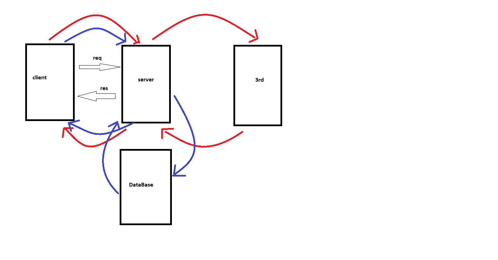

# Movies-Library

# Movies-Library - v18.16.0

**Author Name**: Haya Hassan

DataBase Name : moviesdb , table name: movies
you can add a movie from the body and, get all the data in the table using the specific route

## WRRC
Add an image of your WRRC here

## Overview
Movies data and tickets for reservation and information about movies.

## Getting Started
<!-- What are the steps that a user must take in order to build this app on their own machine and get it running? -->
make sure if node is installed, clone the repo link, install the required packages, require and use them.

## Project Features
<!-- What are the features included in you app -->
Its a movies tickets reservation app, the user can reserve a ticket for a specfic movie
easily using this app, it provides the movies that ara availble and their times and locations.